# Secure Registration App - Web Application Security Project
### Live in Production
A Full-Stack Web Application featuring a secure user registration system, built with security best practices following OWASP guidelines.<br/>

🌐 **Frontend:** [Live Demo](https://ivonnebenitesrodriguez.github.io/web-application-security-project) <br/>
🚀 **Backend:** [Railway](https://web-application-security-project-production.up.railway.app)

## 🛠️ Tech Stack

| Layer | Technology |
|-------|-----------|
| Frontend | HTML5, CSS3, JavaScript |
| Backend | Ruby on Rails 8.1.3 |
| Database | PostgreSQL |
| Testing | RSpec, Jest |
| Security | BCrypt, Rack::Attack, Rack::Cors, Dotenv |
| Deployment | GitHub Pages, Railway |

---

## 🖥️ Registration Form

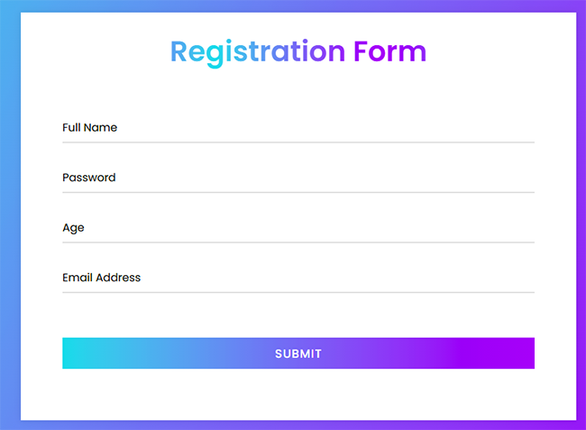

---

## 🔒 Security Measures

### 1. XSS Protection — OWASP A03
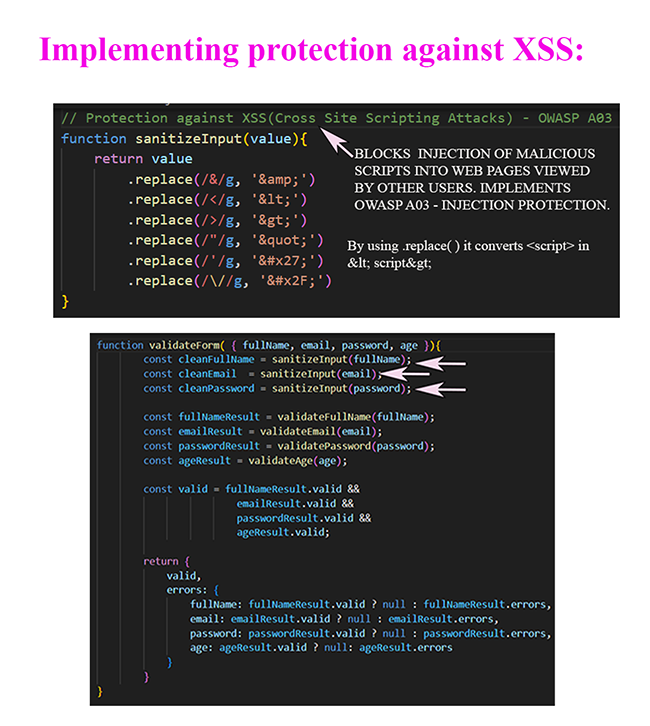

### 2. Mass Assignment Prevention — OWASP A03
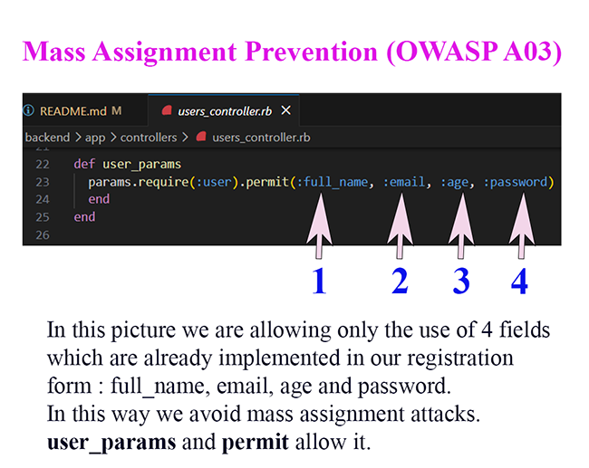

### 3. Gems Used to Implement Security
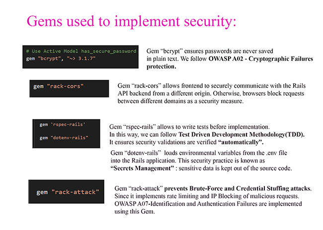

### 4. Password Hashing — OWASP A02
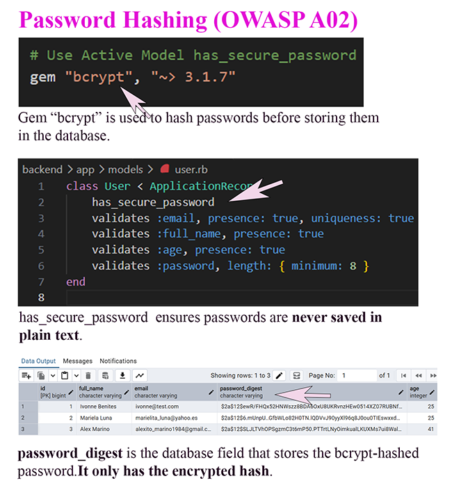

### 5. Secrets Management — OWASP A02
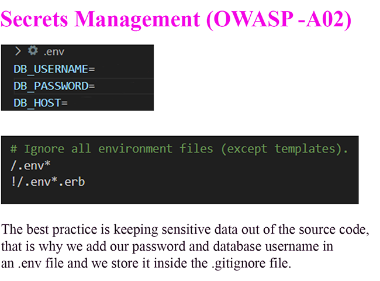

### 6. Brute-Force Protection — OWASP A07
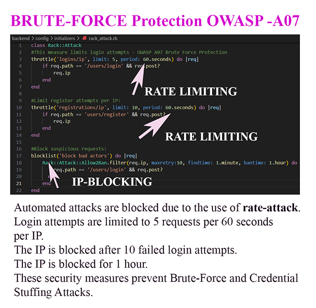

### 7. Log Filtering — OWASP A02
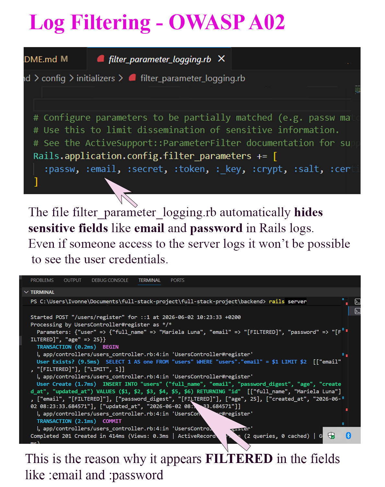

---

## 🧪 Tests

### Backend — RSpec (TDD Methodology)
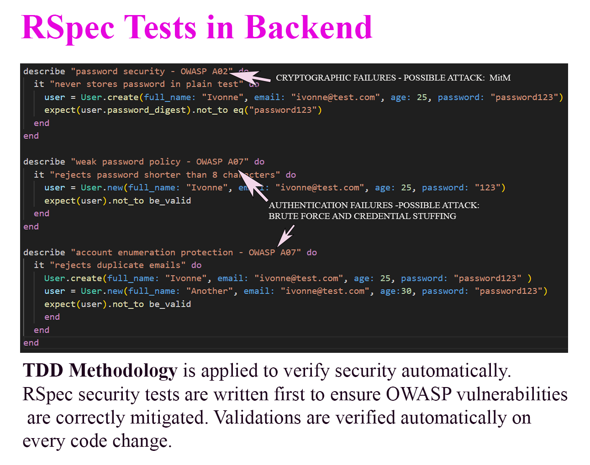

### Frontend — Jest Framework (TDD Methodology)
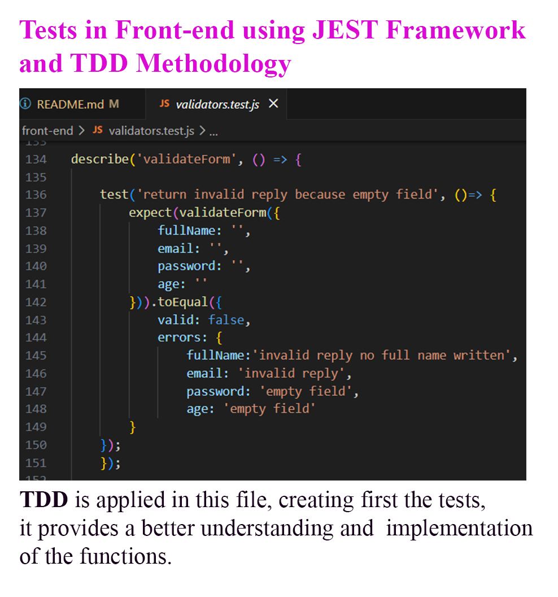

---

## ⚙️ How to Clone & Run the Project

### Requirements
- Ruby 3.4.7
- Rails 8.1.3
- PostgreSQL
- Node.js

### Clone the repository
```bash
git clone https://github.com/IvonneBenitesRodriguez/web-application-security-project.git
cd web-application-security-project
```
### Backend Setup
```bash
cd backend
bundle install
cp .env.example .env
# Add your database credentials in .env
rails db:create db:migrate
rails server
```
### Run Backend Tests
```bash
bundle exec rspec
```
### Frontend
Open `docs/index.html` in your browser or visit the GitHub Pages URL.

### Run Frontend Tests
```bash
cd docs
npm test
```

---

## 🚀 Deployment

| Layer | Platform | URL |
|-------|----------|-----|
| Frontend | GitHub Pages | [Live Frontend](https://ivonnebenitesrodriguez.github.io/web-application-security-project) |
| Backend | Railway | [Live Backend](https://web-application-security-project-production.up.railway.app) |

---

## 🗄️ Database

**PostgreSQL** is used as the production database, hosted on Railway.

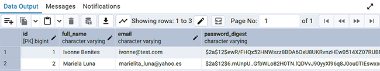

---

## ✅ Live in Production


